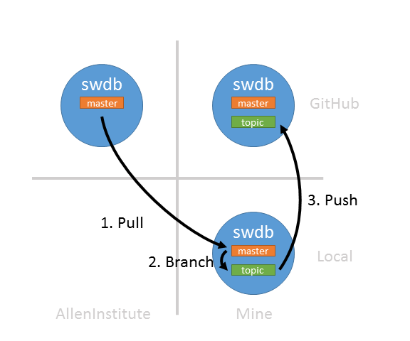
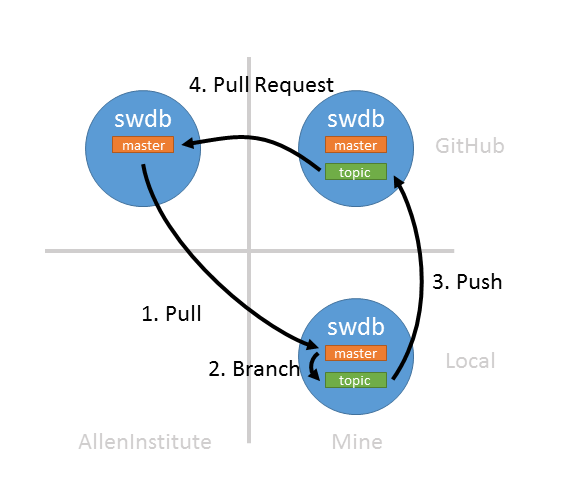
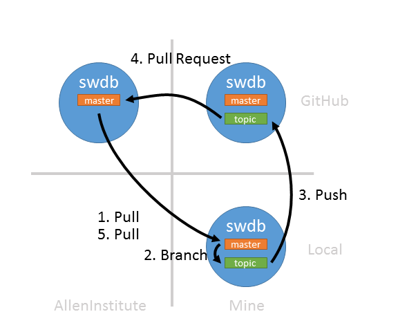

# git lesson 3: Working with Github

This material assumes that you have worked through the previous lessons.  At this point you should understand:

* How to create a repository on your computer
* Stage and commit changes to your repository
* Create topic branches
* Merge topic branches back to your master branch

## Create a repository 

Github is an online code collaboration platform centered around git.  The first thing you should do is create a repository there.  While you can always create an new repository, in this lesson we will be showing you how to collaborate with others on a single repository.  You will do this by creating a copy of an existing repository.  

In `git` parlance, creating a copy of a repository is called `forking`.  Do this:

1. Go here: [https://github.com/alleninstitute/swdb_2018_tools](https://github.com/alleninstitute/swdb_2018_tools)

2. Click the 'Fork' button. 

3. If prompted, tell it to clone the repository to your profile.

You now have a copy of the `swdb_2018_tools` repository all to yourself!

## Clone your repository to your computer

As before, we will be using `GitKraken` when using `git` on your computer.  Now we want to make changes to the fork we just created, so let's bring it down to our computers.

1. Open `GitKraken`
2. File => Clone Repo
3. Github.com
4. Choose a location on your computer to save the repository ("Where to clone to")
5. Browse to your fork (`<user_name>/swdb_2018_tools`)
6. Clone the repo!

## Someone made changes -- bring them to your computer.

Let's say someone has made some changes to the repository you forked and you would like to have those changes on your computer.  

### Tell GitKraken about AllenInstitute/swdb_2018_tools

Right now your repository only knows about your fork (`user/swdb_2018_tools`).  We need our repository to know where these changes are coming from.  We only need to do this once.

1. Click the "+" in the "Remote" section on the left.
2. Paste in: https://github.com/alleninstitute/swdb_2018_tools
3. Accept the default name ("AllenInstitute")

Now the `AllenInstitute` remote appears above your fork in the list below with its default branch (`master`).

### Pull changes from AllenInstitute to your computer

Now we want to bring some changes from `AllenInstitute/master` down to your local master branch.  

1. Right-click the `AllenInstitute` remote and click "Fetch AllenInstitute".  This just checks Github for changes.
2. Right-click the `AllenInstitue/master` branch and choose "Fast-forward changes from AllenInstitute/master".

That's it -- now you've incorporated changes from `AllenInstitute/master` to your local repository.  You can now update the Github's copy of your fork's master branch by clicking "Push".

## Make changes and push them to your fork on Github

Now we want to make some changes to this repository.  Not the AllenInstitute copy, but just your fork on Github.

### Create a topic branch and make a change

Branches are great because they let you work on multiple things at the same time.  So let's make our changes in a branch!

1. Click the 'Branch' icon at the top of the screen.  Give it a cool name.
2. Make some changes that won't conflict.  For example: create a file in the repo directory named after your Github user name.
3. Gitkracken will notice the change -- click "View Change" in the upper right panel.
4. Mouse-over your new file and click "Stage File"
5. Type a commit message.
5. Click "Commit changes to 1 file"

### Push your branch to your fork on Github

Remember: we always want master to be consistent with `AllenInstitute/master`, so we aren't going to merge your topic branch back into `local/master`.  Instead, we are going to push it up to your fork.

1. Right-click your branch, then click "push"
2. Name your branch on Github (use the default, which is the same name)
3. Click "Submit"

## Issue a pull request to AllenInstitute/master

We have your topic branch up on Github with your fork.  Now we want to merge your changes into `AllenInstitute/master`.  We ask for this via a "Pull Request":

1.   Open Github to http://github.com/user_name/SWDB_2018
2.   Github will notice your new branch.  Click "Compare and Pull Request".

## Bring your own change back down to local/master

Once your request has been approved, just bring your changes back down to `local/master` and we're done.

1. Check out `local/master` by double clicking on it.
2. Right-click the `AllenInstitute` remote and click "Fetch AllenInstitute".  This just checks Github for changes.
3. Right-click the `AllenInstitue/master` branch and choose "Fast-forward changes from AllenInstitute/master".

You can now update the Github's copy of your fork's master branch by clicking "Push".
