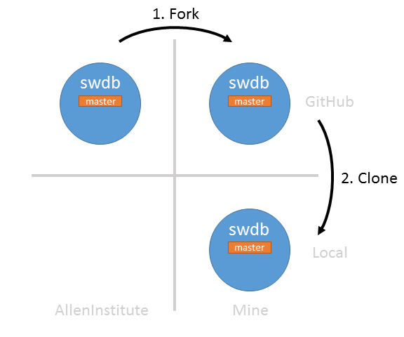
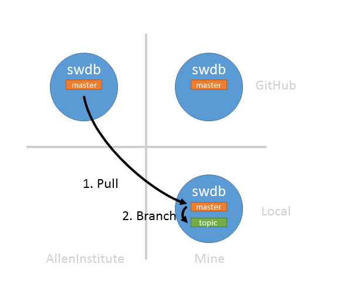
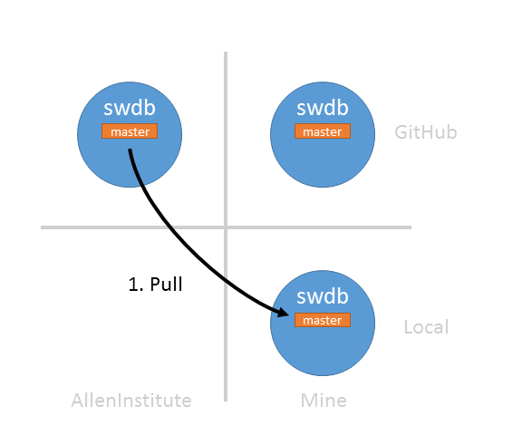

# git lesson 4: Working with GitHub in the Cloud

This material assumes that you have worked through the previous lessons.  At this point you should understand:

* How to create a repository on your computer
* Stage and commit changes to your repository
* Create topic branches
* Merge topic branches back to your master branch
* Work on a shared repository with forks and pull requests

This lesson is identical to lesson 3, but it teaches you how to perform the same operations from the command line.

## Overview: Why this (relatively complex) workflow?

GitHub is an online code collaboration platform centered around `git`.  This lesson shows you a particular way to use `git` and GitHub that is focused on collaboration.  We are trying to solve a few problems here.

1. We want to contribute changes to a repository owned by someone else
2. We want to control when to use changes from that repository
3. We want to minimize nasty merge conflicts 

The rest of these instructions boil down to a few practices:

1. Work in a fork
2. Work in topic branches, not the master branch
2. Use pull requests

Let's get started.

## Oh no I don't have a GUI

Don't panic.  These instructions replicate the exact workflow from lesson three, this time with the Jupyter terminal.

## Create a repository and copy it to your computer (forking and cloning)


 
The first thing you should do is create a repository on GitHub.  While you can always create an new repository, in this lesson we will be showing you how to collaborate with others on a single repository.  You will do this by creating a copy of an existing repository.  In `git` parlance, creating a copy of a repository is called `forking`.  

#### Fork a repository

Do this:

1. Go here: [https://github.com/alleninstitute/swdb_2018_tools](https://github.com/alleninstitute/swdb_2018_tools)
2. Click the 'Fork' button. 
3. If prompted, tell it to clone the repository to your profile.

You now have a copy of the `swdb_2018_tools` repository all to yourself!

#### Clone your fork to your computer (in the cloud!)
 
Now we want to make changes to the fork we just created, so let's bring it down to our computers.  Instead of GitKraken, we'll use the Jupyter Terminal.

1. Open the Jupyter Terminal ("new" => "terminal")
2. Copy the URL of the GitHub repository you want to clone to your clipboard.  (e.g. https://github.com/dyf/SWDB_2018.git)
3. Clone the repo!
```bash
$ git clone https://github.com/dyf/SWDB_2018.git
```

## The virtuous collaborative loop -- integrating changes and making your own

You now have two copies of someone else's repository -- the one on GitHub and the one on your computer.  Those repositories all have a `master` branch.  An important principle to remember:

> **Leave the `master` branch alone**. It is a shared resource -- it should always reflect the state of the primary repository's `master` branch (in this case `AllenInstitute/swdb_2018_tools`).

We'll now describe a process you can use to integrate others changes and make changes safely.  But first...

#### Tell `git` about AllenInstitute/swdb_2018_tools

Right now your repository only knows about your fork (`user/swdb_2018_tools`).  In order to incorporate changes from others, we need our repository to know where these changes are coming from.  We only need to do this once.

```bash
$ git remote add AllenInstitute https://github.com/alleninstitute/swdb_2018_tools
```

#### Loop Step 1: Pull changes from AllenInstitute to your computer


Now we want to bring some changes from `AllenInstitute/master` down to your local master branch.  

```bash
$ git checkout master # let's make sure we're on the master branch
$ git pull AllenInstitute master
```

That's it -- now you've incorporated changes from `AllenInstitute/master` to your local repository.  You can now update the Github's copy of your fork's master branch by pushing it:

```bash
$ git push origin master
```

#### Loop Step 2: Create a topic branch and make a change



Now we want to make some changes to this repository.  Not the AllenInstitute copy (yet) -- just your local copy.

Topic branches are great because they let you work on multiple things at the same time.  In this case, they are necessary because remember: **don't touch the `master` branch**.  So let's make our changes in a topic branch!

```bash
$ git checkout -b dyf_branch # create a new branch and check it out
$ touch dyf.txt # create an empty file
$ git add dyf.txt
$ git commit -m "adding dyf.txt"
```

#### Loop Step 3: Push your branch to your fork on Github


Our topic branch is ready, and we'd like to get our changes integrated into `AllenInstitute/master`.  GitHub has a great facility for this, so we need to get your changes up to your GitHub fork.  Remember: we always want `master` to be consistent with `AllenInstitute/master`, so we aren't going to merge the topic branch back into `local/master`.  Instead, we are going to push your topic branch up to your fork and integrate it into `AllenInstitue/master` from there.

```bash
$ git push origin dyf_branch
```

#### Loop Step 4: Issue a pull request to AllenInstitute/master


We have your topic branch up on your GitHub fork.  Now we want to merge your changes into `AllenInstitute/master`.  We ask for this via a "Pull Request":

1.   Open Github to http://github.com/user_name/SWDB_2018
2.   Github will notice your new branch.  Click "Compare and Pull Request".

Pull requests are great.  We are working on a shared repository, so we really want to make sure that your changes are ready to integrate before pulling the trigger.  Pull requests give everyone a mechanism to review and propose new changes before updating the `master` branch.

#### Loop Step 5: Bring your own change back down to local/master


Once your request has been approved, `AllenInstitute/master` is now has your cahnges in it.  Just bring your changes back down to `local/master` and we're done.

```bash
$ git checkout master # just to be safe
$ git branch -d dyf_branch # delete the branch
$ git pull AllenInstitute master
```

You can now update the Github's copy of your fork's master branch by pushing it:

```bash
$ git push origin master
```

#### All together now


